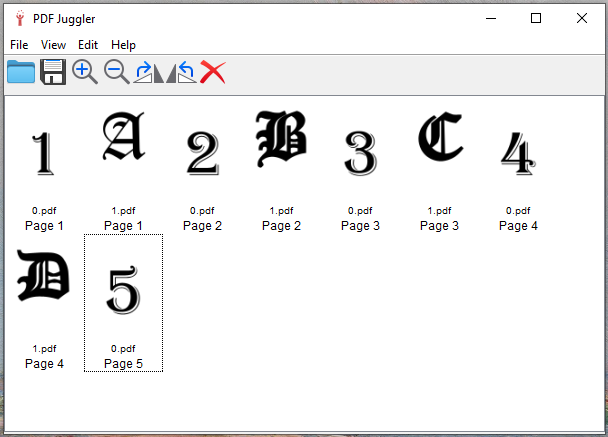

# PDF Juggler
> A desktop tool to mix, reorder and select PDF pages

## Table of contents

- [What is PDF Juggler](#what-is-pdf-juggler)
- [What does it look like](#what-does-it-look-like)
- [License](#license)

## What is PDF Juggler

PDF Juggler is a simple desktop tool to mix, reorder and select PDF pages. Drop your PDFs into the PDF Juggler window, move the pages around, delete them, rotate them, save the result and you're done!

This tool is a clone of [PDF Shuffler](https://sourceforge.net/projects/pdfshuffler/) and [PDF Arranger](https://github.com/pdfarranger/pdfarranger/), which are a must have for anyone who deals with PDF files. Why did I build PDF Juggler, then? To pay my daily tribute to universal firstly, and to have a flawless experience on Microsoft Windows secondly. :-)

## What does it look like

Nothing fancy:

# License

PDF Juggler is licensed under the terms of the GNU General Public License version 3.
